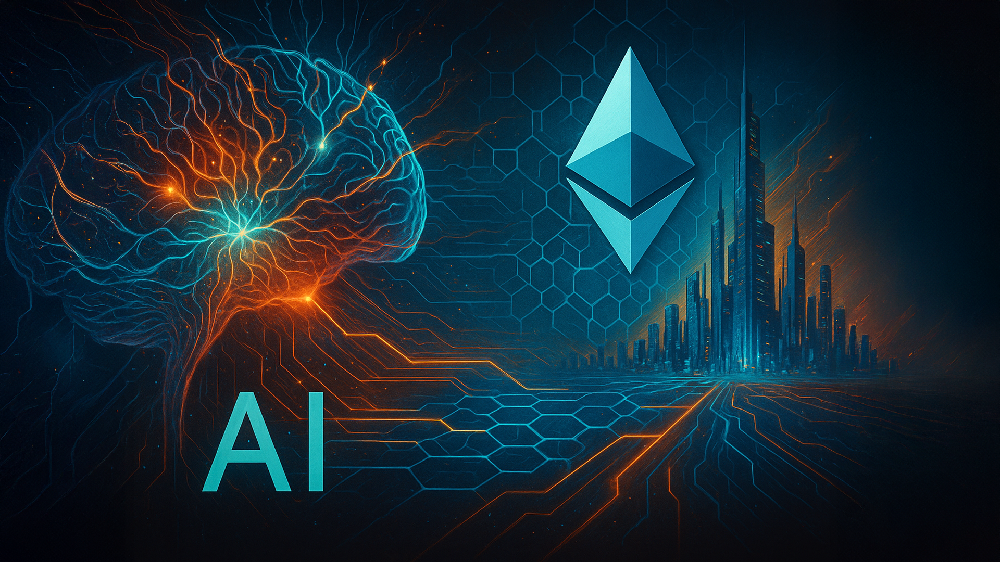
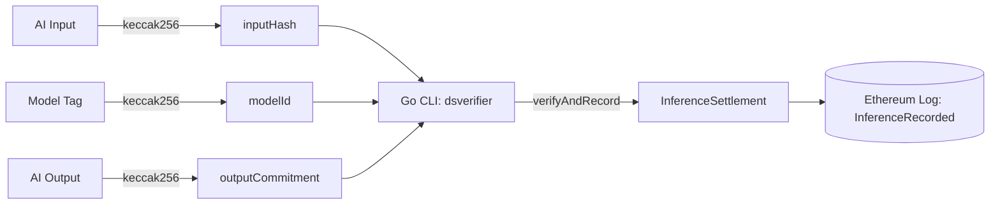
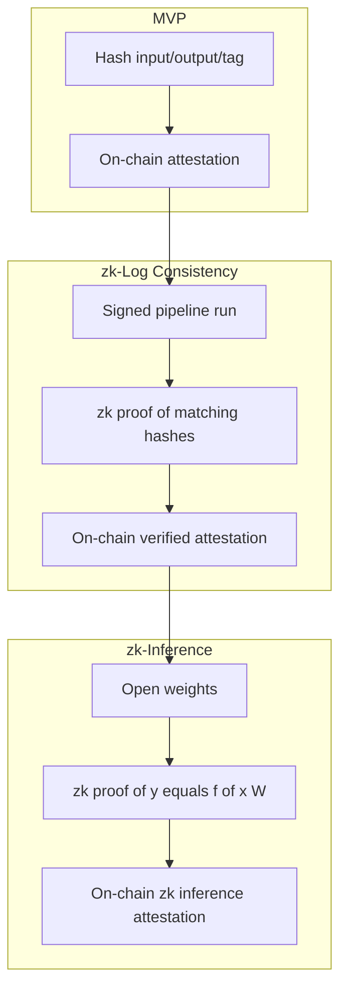

# zk-llm-verifier-eth

_Verifiable AI provenance anchored to Ethereum. Go + Solidity MVP with a clear path to zk proofs._

## Table of Contents
- [Overview](#overview)
- [Why It Matters](#why-it-matters)
- [Architecture](#architecture)
- [Getting Started](#getting-started)
- [CLI Commands](#cli-commands)
- [Implementation Blueprint](#implementation-blueprint)
- [Example Use Case](#example-use-case)
- [Roadmap](#roadmap)
- [Further Reading](#further-reading)
- [License](#license)

## Overview

`zk-llm-verifier-eth` is a provenance primitive that records AI inference commitments on an Ethereum-compatible chain. Each inference is reduced to a tuple of hashes — `modelId`, `inputHash`, `outputCommitment`, and the `prover` address — that is emitted on-chain as an immutable event. This repository collects the specification, quickstart, and step-by-step guides for a minimal Go + Solidity implementation.

## Why It Matters

AI providers can silently swap models, tweak parameters, or fabricate outputs. Without provenance, users must trust unverifiable claims. Anchoring provenance to Ethereum unlocks:

- A neutral, censorship-resistant settlement layer for AI attestations.
- Cryptographic accountability for model, input, and output binding.
- Auditability for regulators, counterparties, and downstream agents.
- A foundation for future zk-log and zk-inference upgrades.

## Architecture

Components of the MVP:

- **On-chain contract — `InferenceSettlement`**: Solidity contract that exposes `verifyAndRecord` and emits `InferenceRecorded` events containing the hash tuple and an `attestationId`.
- **Off-chain client — `dsverifier`**: Go CLI that hashes local artifacts, derives the model commitment from a tag, and submits the attestation transaction.
- **Ledger — Ethereum-compatible chain**: Works with Anvil for local development or testnets like Sepolia/Base Sepolia for public provenance.



Upgrade path:



## Getting Started

### Prerequisites
- Go 1.22+
- Foundry toolchain (`forge`, `anvil`, `cast`)
- Make

Install Foundry:
```bash
curl -L https://foundry.paradigm.xyz | bash
foundryup
```

### Quickstart (local Anvil)
Follow the copy-paste flow in [`Quickstart.md`](Quickstart.md), or run the commands below:
```bash
# 1. start a local Ethereum node
anvil -p 8545

# 2. deploy the contract using an Anvil private key
export RPC_URL=http://localhost:8545
export PRIVATE_KEY=<anvil_private_key>
make onchain-deploy
export CONTRACT_ADDR=<deployed_address>

# 3. build the Go CLI
make ds-build

# 4. create example artifacts
echo '{"example":"delta"}' > examples/input.json
echo 'Risk summary text (AI output)...' > examples/output.txt

# 5. submit an attestation
make ds-attest \
  INPUT=examples/input.json \
  OUTPUT=examples/output.txt \
  CONTRACT=$CONTRACT_ADDR \
  TAG=DeltaSignal-v0.1
```
Result: transaction hash + `InferenceRecorded` event stored on-chain.

Inspect the event via Anvil logs or `cast logs --rpc-url $RPC_URL $CONTRACT_ADDR`.

## CLI Commands

| Target | Description |
| --- | --- |
| `make onchain-build` | Compile the Solidity contract with Foundry. |
| `make localnet` | Start a local Anvil node on port 8545. |
| `make onchain-deploy` | Deploy `InferenceSettlement` using `RPC_URL` and `PRIVATE_KEY`. |
| `make ds-build` | Build the Go CLI (`go/bin/dsverifier`). |
| `make ds-attest` | Submit an inference attestation (`INPUT`, `OUTPUT`, `CONTRACT`, optional `TAG`). |

CLI flags when invoking `go/bin/dsverifier` directly:
- `-rpc` — RPC endpoint (defaults to `http://localhost:8545`).
- `-contract` — deployed `InferenceSettlement` address.
- `-key` — hex-encoded prover private key.
- `-input` / `-output` — file paths to hash.
- `-tag` — pipeline/model tag (defaults to `DeltaSignal-v0.1`).

## Implementation Blueprint

Following [`StepByStep.md`](StepByStep.md) will scaffold the implementation with this layout:
```text
zk-llm-verifier-eth/
├── onchain/
│   ├── src/InferenceSettlement.sol    # Solidity contract
│   ├── script/Deploy.s.sol            # Deploy script (Foundry)
│   └── foundry.toml                   # Foundry configuration
├── go/
│   ├── cmd/dsverifier/main.go         # CLI entrypoint
│   ├── pkg/eth/settlement.go          # Ethereum client wrapper
│   └── go.mod                         # Go module definition
├── examples/                          # Sample input/output artifacts
├── Makefile                           # Build + run helpers
├── README.md                          # High-level overview
├── Specification.md                   # Detailed spec & roadmap
├── Quickstart.md                      # Copy-paste demo runbook
└── LICENSE
```

## Example Use Case

**DeltaSignal** — an AI pipeline that analyzes SEC filings:
- Boards and investors verify outputs correspond exactly to source filings.
- Pipeline swaps or tampering attempts become evident on-chain.
- Compliance, trading, and governance workflows gain cryptographic assurance.

## Roadmap

- zk-log consistency proofs tied to signed pipeline runs.
- Parameter commitments for prompts, decoding settings, and API receipts.
- Replication committees providing multi-signer attestations for closed models.
- zk-inference proofs for open-source models using Noir, RiscZero, or ezkl.
- zk-friendly vault extensions built with Go, Kubernetes, and Foundry-based Ethereum modules to keep provenance anchored while supporting cross-domain coordination.

## Further Reading

- [`Specification.md`](Specification.md) — detailed architecture, justification, and roadmap context.
- [`StepByStep.md`](StepByStep.md) — scaffold plus implementation walkthrough.
- [`Quickstart.md`](Quickstart.md) — 5-minute end-to-end demo.
- [`ExampleWorkflow.md`](ExampleWorkflow.md) — end-to-end provenance walkthrough, including the Azure AI closed-model flow.
- [LinkedIn: Where AI Meets Ethereum](https://www.linkedin.com/pulse/where-ai-meets-ethereum-constantine-vassilev-7g7ec/?trackingId=MD666kbliq2o36Emq1RKLQ%3D%3D) — article on bridging decentralized provenance with AI systems.

## License

MIT

---
